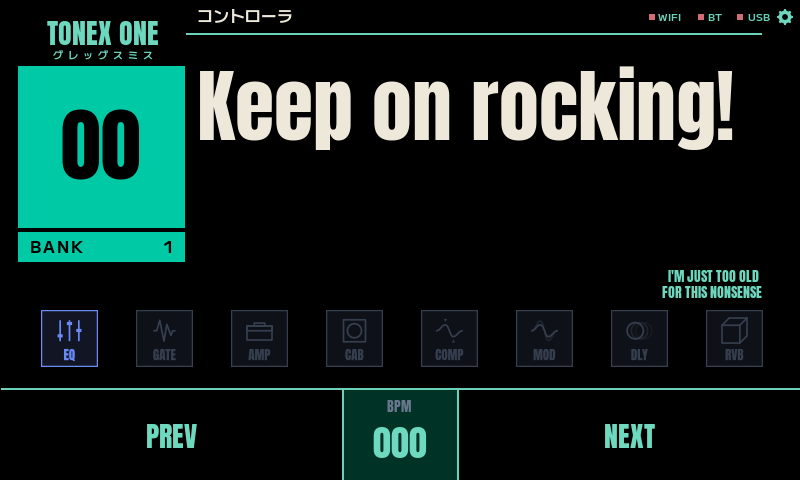

# Mint UI — Waveshare 4.3B fork

A restyled "mint" user interface for the **Waveshare ESP32-S3 4.3B (800×480)**, ported from the 480×320 CustomUI design onto the 4.3B and wired to live pedal data. This is a fork of [Builty/TonexOneController](https://github.com/Builty/TonexOneController).



> The screenshot above is a render from the built-in PC simulator (`simulator800/`), so it shows placeholder text; on the device the preset number, name, BPM and effect states are filled in live from the pedal.

## What's changed in this fork

- **New "mint" UI for the 4.3B (800×480).** Black background, teal/mint accent (`#6ED8BF`), heavy **Anton** display font for the big preset number and name, **M PLUS** font for the Japanese labels, flat signal-chain effect icons (grey = off, coloured = on, active block highlighted), and an arc-knob settings screen.
- **Ported from 480×320 to 800×480** and hooked up to the live pedal data (preset number → number pill, preset name → hero label, BPM, and per-effect on/off states) in `display.c` / `display_tonex.c`. Legacy widgets the new design drops are provided as hidden stubs via `screens_compat.c`.
- **Fixed the 4.3B frame-offset regression.** V2.0.4.2-beta5 shifts the whole frame up/down between boots on some 4.3B panels. Reverted the RGB pixel clock to **13.1 MHz** with `vsync` porch **16/16** (the V2.0.2.2-beta2 known-good values) in `source/main/platform_ws43.c` — the frame now stays centred across power cycles.
- **`simulator800/` — headless UI preview.** Renders the real firmware `screens.c` to a PNG on a PC (no SDL/cmake needed, just `gcc` + the vendored LVGL): `cd simulator800 && ./preview.sh` → `preview.png`.
- The design is edited visually in **[EEZ Studio](https://www.envox.eu/studio/)** (`ui_design_800x480land/Tonex_Controller_800_480land.eez-project`). **After every EEZ *Build*, run `bash simulator800/restore_compat_stubs.sh`** — EEZ regenerates `screens.h` and wipes the hand-added `COMPAT STUBS` block that the firmware needs to compile.

## Flashing the Waveshare 4.3B

**Prerequisites:** [ESP-IDF v5.5.1](https://docs.espressif.com/projects/esp-idf/en/v5.5.1/esp32s3/get-started/) installed (e.g. in `~/esp/esp-idf`).

1. Connect the 4.3B board to your PC over USB. On Linux it enumerates as the ESP32-S3 USB-JTAG serial port, usually **`/dev/ttyACM0`**.
   - If you get a permission error, grant access: `sudo chmod a+rw /dev/ttyACM0` (or add yourself to the `dialout` group and re-login).
2. Configure the ESP-IDF environment and build:
   ```bash
   . ~/esp/esp-idf/export.sh
   cd source
   # first time only — creates the build config for the 4.3B:
   idf.py -B build_ws43b -D SDKCONFIG_DEFAULTS="sdkconfig.defaults;sdkconfig.ws43B" set-target esp32s3
   # build:
   idf.py -B build_ws43b build
   ```
3. Flash it:
   ```bash
   idf.py -B build_ws43b -p /dev/ttyACM0 flash
   ```
   The board resets into the new firmware automatically.

> **If you edited the UI in EEZ Studio first:** run `bash simulator800/restore_compat_stubs.sh` before step 2, otherwise the build fails on missing `objects_t` fields.

Serial debug logs go to a separate UART TX pin (see `FirmwareDevelopment.md`), not the USB port, so the USB console is quiet at idle — that is normal, not a crash.
